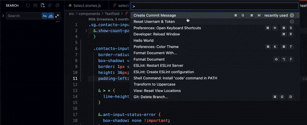

# JIRA Git Commit Message Extension for VS Code

This VS Code extension automatically inserts the details of currently assigned JIRA tickets into Git commit messages, helping to ensure that necessary information is included and reducing errors.

  

## Features

- Automatically inserts JIRA ticket details into Git commit messages
- Retrieves the details of the currently assigned JIRA ticket using the JIRA REST API
- Caches API responses for improved performance and reduced API usage
- Clears cache on window close to avoid stale data

## Installation

Install the extension from the VS Code marketplace by searching for "JIRA Commit Message" or by following [this link](https://marketplace.visualstudio.com/items?itemName=SamuelLawrentz.jira-git-commit-helper).

## Configuration

The extension can be configured through the following settings:

The extension will get the configuration when its first activated. If you change the configuration, you need to reload the window to make it work.

- `jiraCommitMessage.baseURL`: The URL of your JIRA instance, e.g. `https://mycompany.atlassian.net`.
- `jiraCommitMessage.username`: The email/username to use for the JIRA API.
- `jiraCommitMessage.token`: The API token to use for the JIRA API. You can generate one in your JIRA profile settings. (See [here](https://confluence.atlassian.com/cloud/api-tokens-938839638.html) for more information.)

## Usage

When creating a new Git commit, the extension will automatically retrieve the details of the currently assigned JIRA ticket and insert them into the commit message template. The commit message will then be pre-filled with the JIRA ticket information, which can be edited as necessary.

To activate the extension, open the command palette (Ctrl+Shift+P) and select "JIRA Commit Message: Create Commit Message".
- You can select a JIRA ticket from the list of tickets assigned to you or enter a ticket ID manually.
- Select the type of commit you are making from the list of available commit types.
- Enter a commit message and press Enter to create the commit.

## Contributing

If you wish to contribute to this extension, please follow the steps below:

1. Fork the repository
2. Clone your fork to your local machine
3. Create a new branch for your changes
4. Make your changes and commit them
5. Push your branch to your fork
6. Open a pull request

## License

This extension is licensed under the [MIT License](./license.md).
